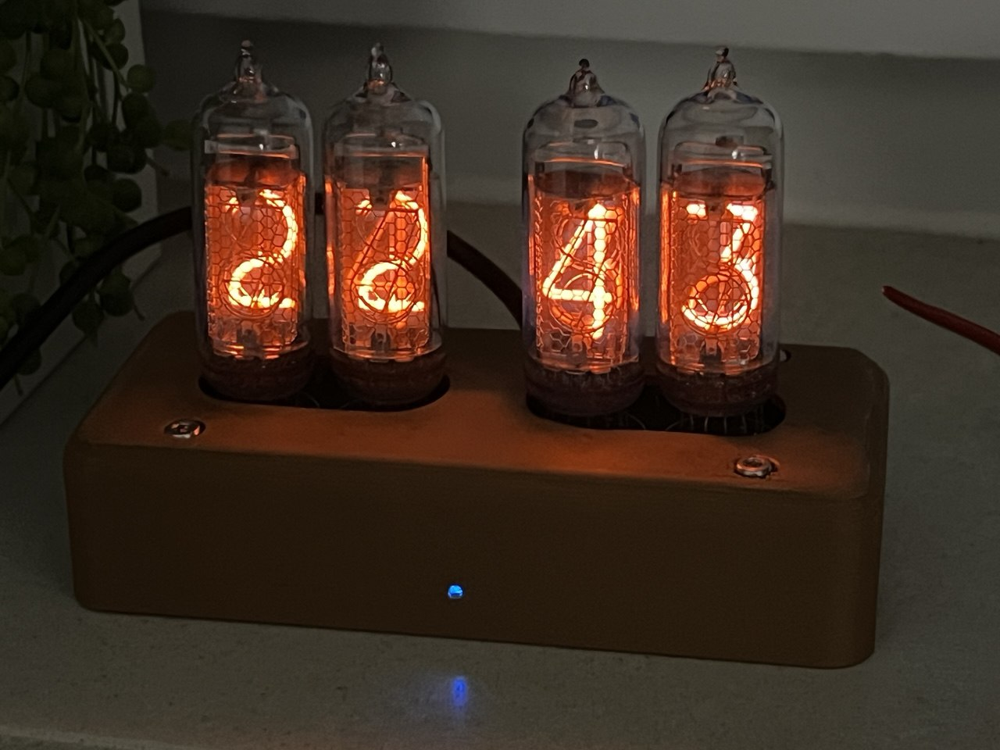
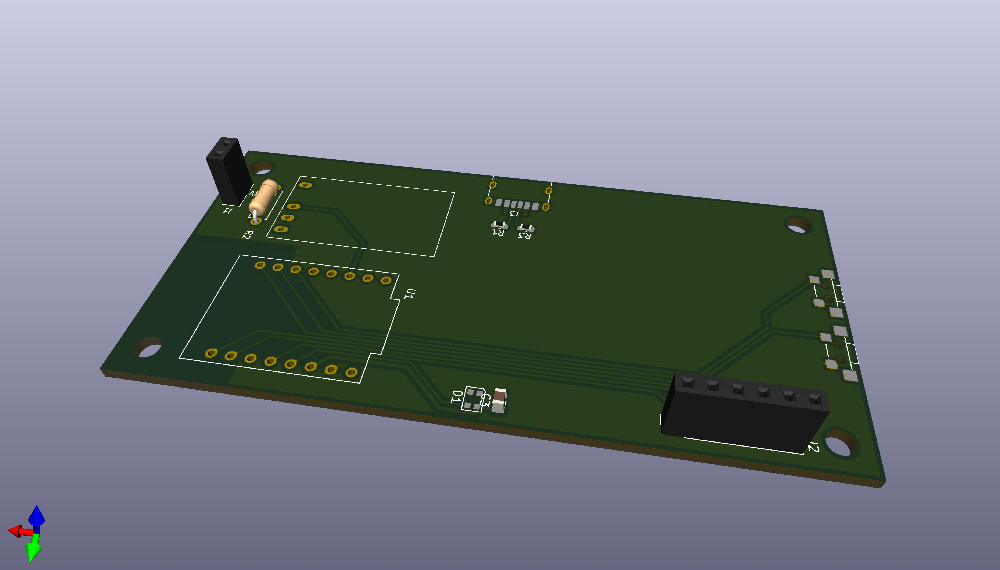
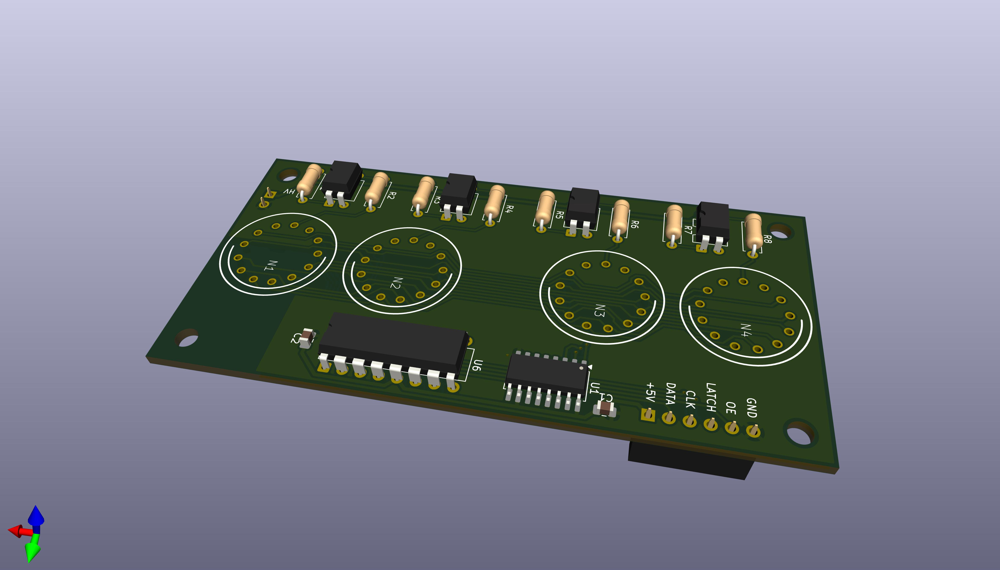
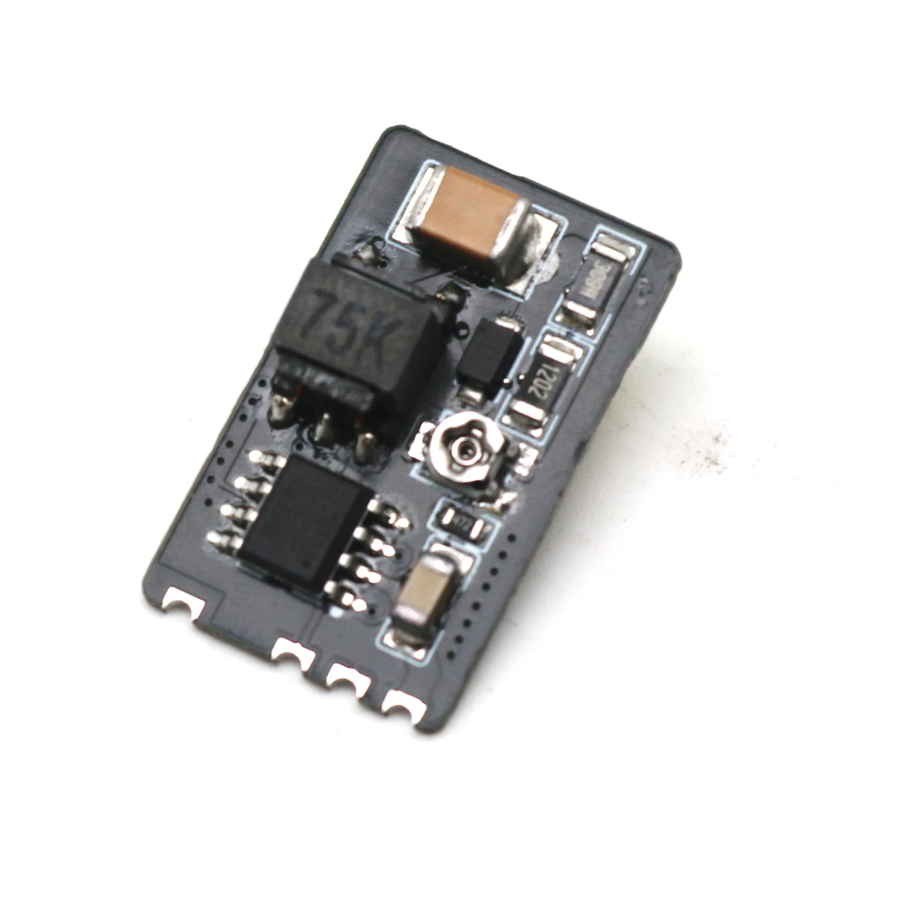

# Nixie Clock

An ESP32-C3 powered Nixie clock built around custom KiCad hardware and Arduino firmware.

## Boards

### Main board

### Indicator board

## What this is

This repository contains the hardware and firmware for a four-digit Nixie clock.
It uses Wi-Fi to sync time from NTP, drives the tubes with a multiplexed display stage, and keeps the high-voltage supply disabled until the clock has a valid time.

## Features

- Wi-Fi time sync via NTP
- Automatic high-voltage safety control
- OTA firmware updates
- Manual cathode cleaning from a button long-press
- Automatic daily cathode cleaning at midnight
- KiCad hardware for the main clock board and indicator board

## Key components

- IN-14 Nixie tubes
- 155ИД1 high-voltage digit driver
- ESP32-C3 SuperMini module
- 74HC595 shift register
- TLP627 optocouplers
- Nixie Tube Boost Converter module
- WS2812B RGB status LED
- USB-C power input
- Two push buttons

### High-voltage boost module

I've used this particular module found on AliExpress. It features voltage adjustment. Other modules should also work, but they'll require proper wiring. 

## How it works

The firmware boots in a safe state with the display blanked and the high-voltage rail off.
After Wi-Fi connects and NTP provides a valid time, the clock enables the high-voltage section and starts showing the current time.

When a successful sync happens, the firmware opens a short OTA maintenance window. If an upload starts, the high-voltage rail is disabled while the update is in progress.

Button 1 has a long-press action that starts cathode cleaning manually. The same cleaning routine also runs automatically once per day when the clock reaches midnight.

## Repository layout

- `firmware/` - PlatformIO project for the ESP32-C3
- `hardware/main/` - main KiCad project for the clock board
- `hardware/indicators/` - indicator-board KiCad project
- `docs/` - photos and other documentation assets

## Firmware setup

1. Open `firmware/` in PlatformIO or your preferred VS Code setup.
2. Copy `firmware/src/config.h.example` to `firmware/src/config.h`.
3. Fill in your Wi-Fi SSID and password.
4. Build and upload the `esp32c3` environment.

The firmware is configured for the `esp32-c3-devkitm-1` board.

## Notes

- The clock currently uses a CET/CEST timezone definition in firmware.
- The firmware hostname is `nixie-clock`.
- `firmware/src/config.h` is ignored by Git so local Wi-Fi credentials stay machine-specific.
